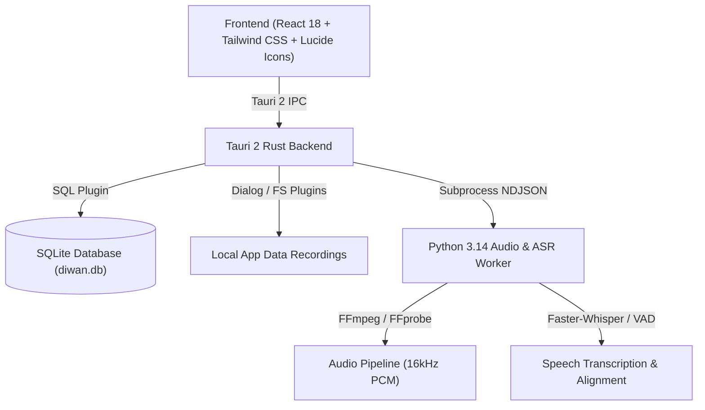

# دِيـــوَان — Diwan
### Arabic Poetry & Synchronized Audio Alignment Desktop Platform
**منصة ديوان للشعر العربي، الاستماع التفاعلي، والمحاذاة الصوتية الدقيقة**

---

## 🌟 نظرة عامة (Overview)

**ديوان (Diwan)** هو تطبيق مكتبي عالي الأداء مبني باستخدام **Tauri 2** و**React 18** و**TypeScript** و**Python**، مصمم خصيصاً للشعر العربي وخصائصه البلاغية والعروضية والصوتية.

يعمل التطبيق **محلياً بنسبة 100% (Offline-First)** دون الحاجة إلى خوادم سحابية، مما يضمن الخصوصية الكاملة والأداء الفائق.

---

## ✨ الميزات الرئيسية (Key Features)

1. **المشغّل الصوتي المتزامن (Synchronized Verse Player)**:
   - متابعة وتظليل البيت النشط أثناء الاستماع بدقة الميلي ثانية (`start_ms`, `end_ms`).
   - التمرير التلقائي السلس مع احترام التمرير اليدوي للمستخدم.
   - النقر على أي بيت للانتقال الفوري إلى موقعه الصوتي.
   - اختصارات لوحة المفاتيح (`Space`, `Arrows`, `J/K/L`).

2. **معالج الصوتيات والذكاء الاصطناعي (Python ASR & Audio Worker)**:
   - تحويل الصوتيات إلى WAV 16kHz mono باستخدام FFmpeg.
   - كشف النشاط الصوتي (Voice Activity Detection - VAD).
   - التفريغ الصوتي باللغة العربية مع طوابع زمنية على مستوى الكلمة (Faster-Whisper).

3. **المحاذاة القسرية والتطبيع اللغوي (Forced Alignment & Normalization)**:
   - إزالة وتوحيد الحركات، التنوين، الشدة، الهمزات، والتاء المربوطة.
   - مطابقة النص الصوتي المفرّغ مع أبيات الشعر المكتوبة وحساب درجات الثقة.

4. **محرر تدقيق الحدود الزمنية (Boundary Review Editor)**:
   - واجهة مخصصة لعرض المخطط الصوتي وتعديل بدايات ونهايات الأبيات يدوياً.
   - أزرار دوزنة دقيقة (`+50ms`, `-50ms`, `+200ms`, `-200ms`).
   - استماع تكراري لحدود البيت (Loop Audition).
   - تبديل حالة التدقيق (`آلي` ← `مدقق` ← `يدوي`).

5. **المعجم اللغوي وتحليل بحور الشعر (Dictionary & Arud Analysis)**:
   - النقر على أي كلمة في القصيدة لعرض معناها وجذرها اللغوي من لسان العرب والمعاجم التراثية.
   - كشف البحر الشعري وتفصيل التفاعيل (الطويل، البسيط، الكامل، الوافر، إلخ).
   - استخراج حرف الرويّ والقافية.

6. **التصدير والتقطيع الصوتي (Audio Segmentation & Synchronized Lyrics)**:
   - تقطيع التسجيل الصوتي إلى مقاطع صوتية مستقلة لكل بيت (`verse_001.wav`, `verse_002.wav`).
   - تصدير كلمات متزامنة بصيغة **LRC**.
   - تصدير ترجمات وتسميات بصيغة **SRT**.
   - تصدير حزمة ديوان الشاملة بصيغة **JSON**.

---

## 🏛 البنية المعمارية (Architecture)



---

## 🚀 التثبيت والتشغيل (Getting Started)

### المتطلبات الأساسية (Prerequisites)
- **Node.js**: v18+ (موصى به v20 أو v24)
- **Rust & Cargo**: 1.75+
- **Python**: 3.10+ مع تثبيت `ffmpeg` و `ffprobe`
- **حزم النظام (Linux)**: `webkit2gtk-4.1`, `libsoup`, `openssl`

### 1. تثبيت الاعتماديات
```bash
# تثبيت حزم واجهة المستخدم
npm install

# تثبيت حزم معالج بايثون
pip install -e worker/
```

### 2. التشغيل في وضع التطوير
```bash
# تشغيل خادم الواجهة والمحرر
npm run dev

# أو تشغيل التطبيق المكتبي بالكامل عبر Tauri
npm run tauri dev
```

### 3. تشغيل الاختبارات
```bash
# اختبارات معالج بايثون
PYTHONPATH=worker python3 -m pytest worker/tests/

# اختبارات واجهة المستخدم والمكونات
npm test

# فحص المعايير البرمجية
npm run lint

# اختبار التحقق الشامل (E2E Pipeline)
python3 scripts/e2e_verify.py
```

### 4. بناء حزمة الإنتاج (Production Packaging)
```bash
npm run build
npm run tauri build
```

---

## ⌨️ اختصارات لوحة المفاتيح (Keyboard Shortcuts)

| المفتاح | الوظيفة |
| :--- | :--- |
| **مسافة (Space) / K** | تشغيل / إيقاف مؤقت للصوت |
| **السهم الأيمن (→)** | الانتقال للبيت السابق (RTL) |
| **السهم الأيسر (←)** | الانتقال للبيت التالي (RTL) |
| **J** | ترجيع 5 ثوانٍ للخلف |
| **L** | تقديم 5 ثوانٍ للأمام |

---

## 📄 الترخيص (License)
مشروع مفتوح المصدر ومطور وفق أعلى معايير الجودة للثقافة والشعر العربي.
