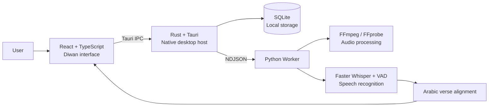

<div align="center">


# Diwan | دِيـــوَان

### Arabic Poetry in Synchronized Voice

**An offline-first desktop and mobile experience for Arabic poetry, synchronized recitation, and intelligent verse alignment.**

[](https://tauri.app/)
[](https://react.dev/)
[](https://www.typescriptlang.org/)
[](https://www.rust-lang.org/)
[](https://www.python.org/)
[](https://www.sqlite.org/)

</div>

---

## About Diwan

**Diwan** is a desktop and mobile platform that brings Arabic poetry, spoken recitation, and intelligent audio alignment together in one experience. It imports poems and recordings, transcribes Arabic speech, aligns timestamps with individual verses, and highlights each verse as it is recited.

## Highlights

- Synchronized audio playback with active-verse highlighting.
- Poem import from Mizan Al-Arab or manual text entry.
- Audio import from YouTube or local files.
- Arabic speech transcription powered by Faster Whisper.
- Intelligent matching between spoken words and written verses.
- A local poetry library with persistent playlists.
- Verse sharing as styled images with multiple backgrounds.
- Export to LRC, SRT, JSON, and individual verse audio clips.
- A native Tauri and Rust desktop application with local SQLite storage.
- A companion mobile application built with Expo.

## Architecture



## Technology

| Technology | Purpose |
|---|---|
| React + TypeScript | User interface and application logic |
| Tailwind CSS + Vite | Styling, development, and frontend builds |
| Tauri + Rust | Native desktop application and operating-system integration |
| SQLite | Local storage for poems, recordings, and alignments |
| Python | Audio processing, transcription, and alignment |
| yt-dlp | YouTube audio retrieval |
| FFmpeg | Audio conversion and inspection |
| Faster Whisper | Timestamped Arabic speech transcription |
| Expo | Companion mobile application |
| Vitest + Pytest | Frontend and Python testing |

## Quick Start

### Requirements

- Node.js 20 or newer
- pnpm
- Rust and Cargo
- Python 3.10 or newer
- FFmpeg and FFprobe
- The Tauri system dependencies for your operating system

```bash
git clone https://github.com/maleksaadi0109/arabic-poetry-desktop.git
cd arabic-poetry-desktop

corepack enable
pnpm install

python3 -m venv .venv
source .venv/bin/activate
pip install -e artifacts/arabic-poetry/worker

pnpm --filter @workspace/arabic-poetry run tauri:dev
```

> Run these commands from the repository root. This monorepo uses pnpm's `catalog:` feature, so `npm install` is not supported.

## Full Documentation

The complete guide includes:

- Ubuntu, Debian, and Arch Linux setup
- Development and production commands
- Frontend and Python tests
- Desktop packaging
- Architecture details
- Keyboard shortcuts
- YouTube cookie and privacy notes

**[Read the complete Diwan documentation →](artifacts/arabic-poetry/README.md)**

For a self-contained Windows package:

**[Read the Windows packaging guide →](artifacts/arabic-poetry/WINDOWS_PACKAGING.md)**

---

<div align="center">

**Diwan — where Arabic poetry meets voice and technology**

</div>