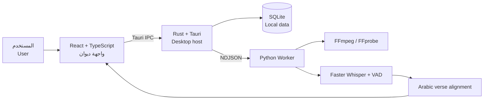

<div align="center">


# دِيـــوَان | Diwan

### الشعر العربي بصوتٍ متزامن

**An offline-first desktop and mobile experience for Arabic poetry, synchronized recitation, and intelligent verse alignment.**

[](https://tauri.app/)
[](https://react.dev/)
[](https://www.typescriptlang.org/)
[](https://www.rust-lang.org/)
[](https://www.python.org/)
[](https://www.sqlite.org/)

</div>

---

## عن ديوان | About

**ديوان** منصة للشعر العربي تجمع القراءة والاستماع في تجربة واحدة. يربط التطبيق التسجيل الصوتي بأبيات القصيدة، ويُبرز البيت الجاري إلقاؤه لحظةً بلحظة، مع أدوات للاستيراد والتنظيم والمراجعة والمشاركة.

**Diwan** connects Arabic poetry with spoken recitation. It imports poems and recordings, transcribes Arabic speech, aligns timestamps with individual verses, and presents everything through an interactive synchronized player.

## أبرز المزايا | Highlights

- مشغّل صوتي متزامن مع الأبيات.
- استيراد القصائد من ميزان العرب أو الإدخال اليدوي.
- تنزيل التسجيلات الصوتية من YouTube أو اختيار ملف محلي.
- تفريغ الكلام العربي باستخدام Faster Whisper.
- محاذاة الكلمات المنطوقة مع أبيات القصيدة.
- مكتبة محلية وقوائم تشغيل.
- مشاركة الأبيات كصور بخلفيات متعددة.
- تصدير LRC وSRT وJSON ومقاطع صوتية.
- تطبيق مكتبي يعمل عبر Tauri وRust مع قاعدة SQLite محلية.
- تطبيق محمول مصاحب مبني باستخدام Expo.

## البنية المعمارية | Architecture



## التقنيات | Technology

| التقنية | الاستخدام |
|---|---|
| React + TypeScript | واجهة المستخدم ومنطق التطبيق |
| Tailwind CSS + Vite | التصميم والتطوير وبناء الواجهة |
| Tauri + Rust | تطبيق سطح المكتب والتكامل مع نظام التشغيل |
| SQLite | حفظ القصائد والتسجيلات والمحاذاة محليًا |
| Python | معالجة الصوت والتعرف على الكلام |
| yt-dlp | تنزيل صوت YouTube |
| FFmpeg | تحويل وفحص التسجيلات |
| Faster Whisper | تفريغ الكلام العربي مع التوقيت |
| Expo | تطبيق الهاتف |
| Vitest + Pytest | الاختبارات |

## البدء السريع | Quick start

> يحتاج المشروع إلى Node.js 20+ وpnpm وRust وPython 3.10+ وFFmpeg وتبعيات Tauri الخاصة بنظام التشغيل.

```bash
git clone https://github.com/maleksaadi0109/arabic-poetry-desktop.git
cd arabic-poetry-desktop

corepack enable
pnpm install

python3 -m venv .venv
source .venv/bin/activate
pip install -e artifacts/arabic-poetry/worker

pnpm --filter @workspace/arabic-poetry run tauri:dev
```

## التوثيق الكامل | Full documentation

توجد تعليمات التثبيت على Ubuntu وArch Linux، والاختبارات، وبناء حزم الإنتاج، وشرح الخصوصية داخل:

**[اقرأ توثيق تطبيق ديوان الكامل →](artifacts/arabic-poetry/README.md)**

كما يتوفر دليل بناء Windows المستقل هنا:

**[Windows packaging guide →](artifacts/arabic-poetry/WINDOWS_PACKAGING.md)**

---

<div align="center">

**دِيـــوَان — حيث يلتقي الشعر العربي بالصوت والتقنية**

</div>