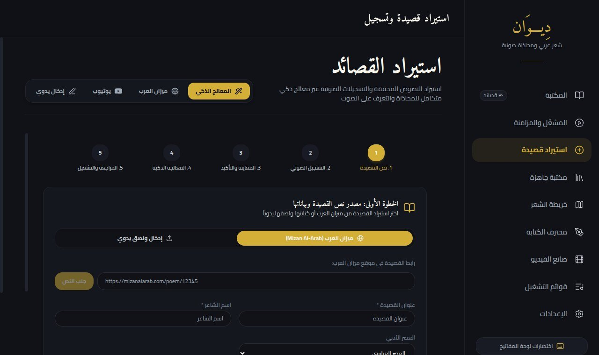
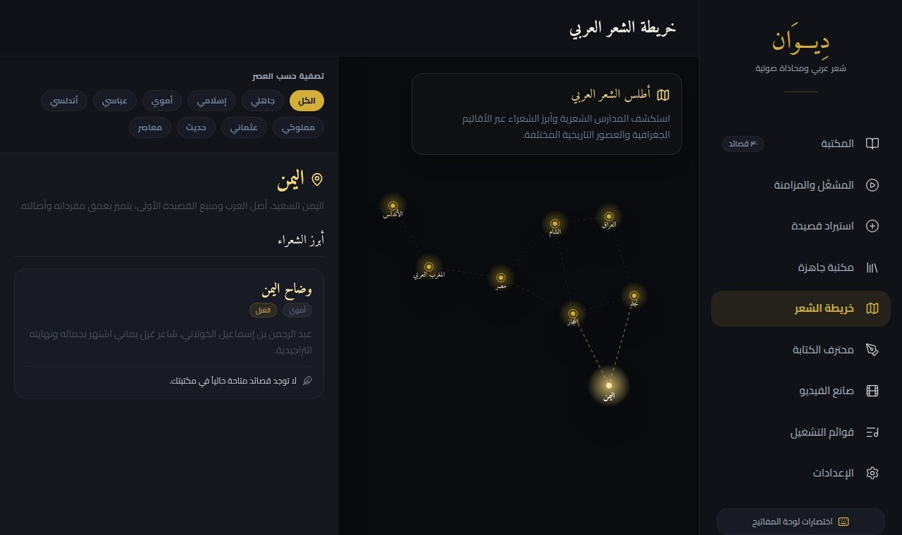
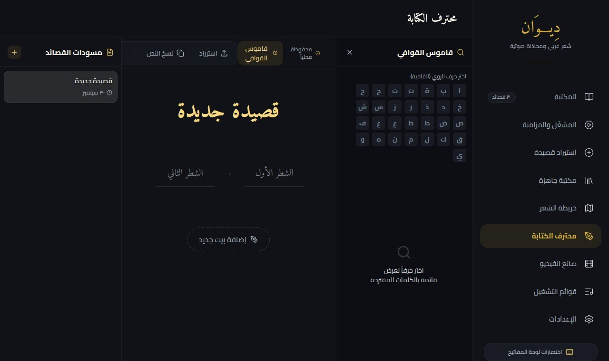
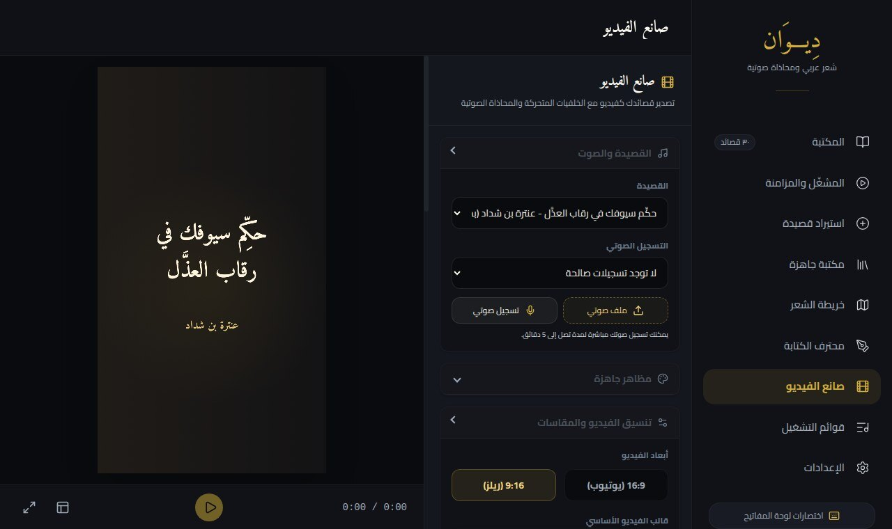

# ديوان · Diwan

**Arabic poetry, made for the desktop.**

Diwan keeps poems, recitations, and verse-by-verse timing together in a local library. Read at your own pace, or listen while the words follow the recording. When the timing needs a closer look, you can adjust it yourself.


## Read and listen

Browse poems by poet and era, search your collection, and open a poem to read or play it. Click a verse to jump to its place in the recording. Diwan stores the collection in a local SQLite database, so your poems stay on your computer.

Some poems include a recording credit but no playable audio file. Add a recording before using playback, alignment, or video features with those poems.

## Bring in a poem

Add a poem by hand or use one of the supported import sources. You can bring in a recording, align the recitation with the verses, and review the timing before saving it to your library.



## Follow the poets

The poetry map connects poets to places and eras. Select a region to learn about its poets, then filter the map by period.



## Write your own

The writing studio gives each draft room for its verses, with a rhyme dictionary close at hand when you need it.



## Make a recitation video

Pair a poem with its recording, choose a visual style, and preview the animated Arabic text before exporting. Export needs a playable recording and a device that supports video recording.



## Run the desktop app

You'll need Node.js (24 recommended), pnpm, Rust, Python 3.13, `uv`, and FFmpeg. On Linux, Tauri also needs WebKitGTK 4.1 and the GTK development libraries. Run these commands from the **repository root**:

```bash
pnpm install --frozen-lockfile
uv sync --python 3.13 --frozen
pnpm --filter @workspace/arabic-poetry run tauri:dev
```

The first launch compiles the Rust application and may take a while.

## Check your changes

```bash
pnpm --filter @workspace/arabic-poetry run typecheck
pnpm --filter @workspace/arabic-poetry run test
PYTHONPATH=artifacts/arabic-poetry/worker uv run pytest artifacts/arabic-poetry/worker/tests
```

The desktop app lives in `artifacts/arabic-poetry/`; its Python audio worker lives in `artifacts/arabic-poetry/worker/`. For more on audio alignment and keyboard controls, see the [desktop app guide](artifacts/arabic-poetry/README.md).