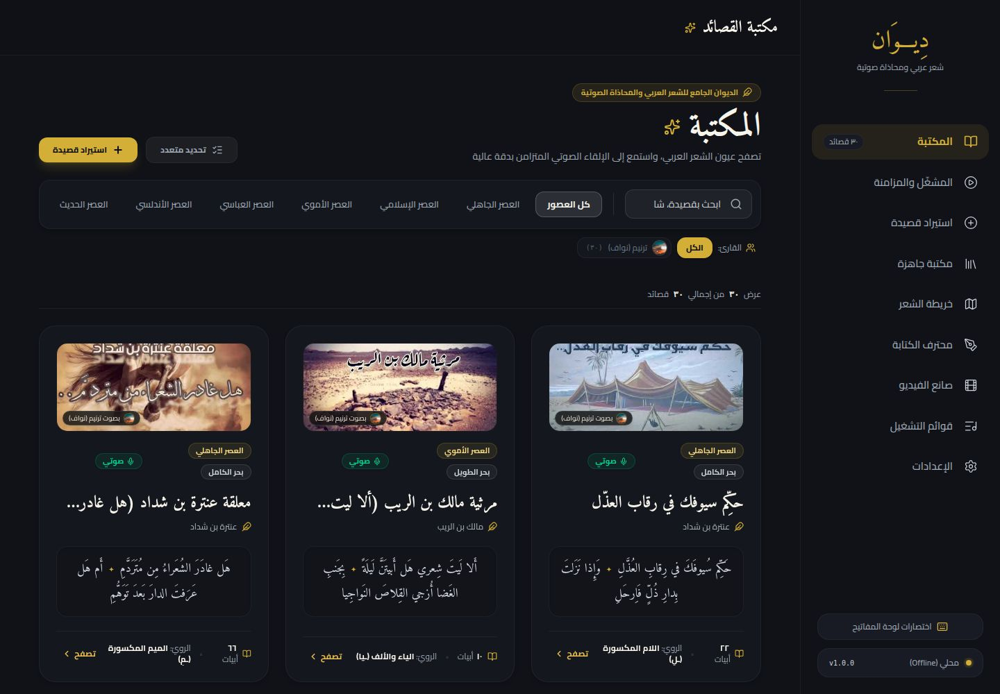

# ديوان · Diwan

**An Arabic poetry library built for reading and listening.**

Diwan brings poems, recordings, and verse-by-verse timing into one desktop app. Browse a local collection, import your own poetry, follow the text as a recitation plays, and adjust timing when the automatic alignment needs a human ear.



## What you can do

- **Read and listen:** browse poems by poet and era, play a recording, and jump to a verse from its text.
- **Build a collection:** import poems and recordings, then keep them in a local SQLite library.
- **Review the timing:** align spoken Arabic with verses and refine the boundaries by hand.
- **Explore and write:** visit the poetry map or use the writing studio to draft and examine verse.
- **Make a video:** pair a recitation with animated Arabic text and export it when the device supports video recording.

Some catalog entries include recording information but no playable audio file. Add a recording before using playback, alignment, or video features that need one.

## Run it

This is a pnpm workspace. Run these commands from the **repository root**, not from inside an artifact:

```bash
pnpm install --frozen-lockfile
uv sync --python 3.13 --frozen
pnpm --filter @workspace/arabic-poetry run tauri:dev
```

You'll need Node.js (24 recommended), pnpm, Rust, Python 3.13, `uv`, and FFmpeg. On Linux, Tauri also needs WebKitGTK 4.1 and its GTK development libraries. The first desktop launch compiles Rust, so it takes longer than later launches.

To work on the interface in a browser instead:

```bash
pnpm --filter @workspace/arabic-poetry run dev
```

The browser preview is useful for layout and reading, but it is **not** the desktop app: Tauri commands, native file access, local SQLite, and the Python audio worker require the native runtime. In Replit, **Start application** opens the browser preview; **Diwan desktop** opens the native window in the desktop view.

## Check your changes

```bash
pnpm --filter @workspace/arabic-poetry run typecheck
pnpm --filter @workspace/arabic-poetry run test
PYTHONPATH=artifacts/arabic-poetry/worker uv run pytest artifacts/arabic-poetry/worker/tests
```

## Where things live

| Path | Purpose |
| --- | --- |
| `artifacts/arabic-poetry/` | React interface and Tauri desktop application |
| `artifacts/arabic-poetry/worker/` | Python transcription and audio alignment |
| `artifacts/api-server/` | API service used by other workspace clients |
| `artifacts/mobile/` | Separate Expo mobile app |
| `lib/` | Shared workspace packages |

The desktop app is the main focus here; the mobile app is a separate client. For more about the audio pipeline and keyboard controls, see the [desktop app guide](artifacts/arabic-poetry/README.md).