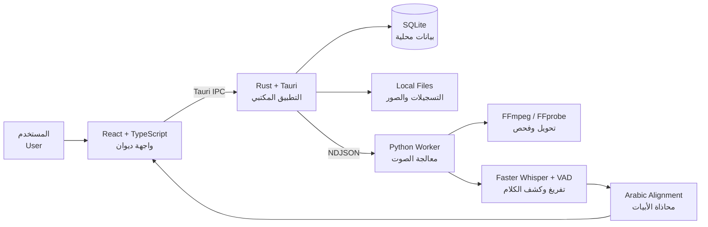

<div align="center">


# دِيـــوَان | Diwan

### الشعر العربي بصوتٍ متزامن

**An offline-first desktop experience for Arabic poetry, synchronized recitation, and intelligent verse alignment.**

[](https://tauri.app/)
[](https://react.dev/)
[](https://www.typescriptlang.org/)
[](https://www.rust-lang.org/)
[](https://www.python.org/)
[](https://www.sqlite.org/)

</div>

---

## عن المشروع | About

**ديوان** تطبيق مكتبي يقدّم الشعر العربي كتجربة قراءة واستماع متكاملة. يربط التسجيل الصوتي بأبيات القصيدة، ويُبرز البيت الجاري إلقاؤه لحظةً بلحظة، مع أدوات للاستيراد والتنظيم والمراجعة والمشاركة.

**Diwan** is a privacy-focused desktop application that connects Arabic poetry with spoken recitation. It imports poems and recordings, transcribes Arabic speech, aligns timestamps with individual verses, and provides an interactive synchronized player.

> يعمل التطبيق محليًا قدر الإمكان: القصائد والتسجيلات وقوائم التشغيل ونتائج المحاذاة محفوظة على جهاز المستخدم.

---

## أبرز المزايا | Highlights

- **مشغّل متزامن للأبيات** — تظليل البيت النشط، انتقال بالنقر، تمرير تلقائي، واختصارات لوحة مفاتيح.
- **استيراد مرن** — كتابة يدوية، روابط ميزان العرب، تسجيلات YouTube، وملفات صوت محلية.
- **تفريغ عربي ذكي** — تحويل الإلقاء إلى نص مؤقت زمنيًا باستخدام Faster Whisper.
- **محاذاة النص بالصوت** — ربط كلمات التسجيل بأبيات القصيدة مع درجات ثقة.
- **مراجعة الحدود الزمنية** — تعديل بداية ونهاية كل بيت والاستماع المتكرر للحدود.
- **مكتبة وقوائم تشغيل** — تنظيم القصائد والتسجيلات في تجربة محلية مستمرة.
- **مشاركة الأبيات كصور** — تصدير البيت بخلفيات حبر وورق وليل وزيتون.
- **أدوات لغوية وعروضية** — معلومات القافية والرويّ وبحور الشعر والشروح.
- **تصدير متعدد** — ملفات LRC وSRT وJSON ومقاطع صوتية مستقلة للأبيات.
- **تجربة مكتبية أصلية** — نوافذ ملفات محلية، قاعدة SQLite، أيقونة نظام، وحزم تثبيت.

---

## كيف يعمل؟ | How it works



### رحلة استيراد قصيدة مسموعة

1. يجلب التطبيق نص القصيدة أو يستقبله من المستخدم.
2. يحمّل التسجيل من YouTube أو يقرأ ملفًا محليًا.
3. يحوّل FFmpeg الصوت إلى صيغة مناسبة للتحليل.
4. يفرّغ Faster Whisper الكلام العربي مع طوابع زمنية.
5. تطبّع خوارزمية المحاذاة النص العربي وتطابقه مع الأبيات.
6. تحفظ النتائج في SQLite ويستخدمها المشغّل لتظليل البيت الحالي.

---

## التقنيات المستخدمة | Tech stack

| التقنية | دورها في ديوان |
|---|---|
| **React 18** | بناء الشاشات والمشغّل وتجربة المستخدم |
| **TypeScript** | نماذج بيانات آمنة وتقليل أخطاء الواجهة |
| **Tailwind CSS** | نظام التصميم والتنسيق المتجاوب |
| **Vite** | خادم التطوير وبناء واجهة الإنتاج |
| **Tauri 2** | تحويل الواجهة إلى تطبيق مكتبي متعدد المنصات |
| **Rust** | التكامل مع النظام، أوامر Tauri، وإدارة معالج Python |
| **SQLite** | تخزين القصائد والأبيات والتسجيلات والمحاذاة محليًا |
| **Python** | معالجة الصوت والتعرف على الكلام والمحاذاة |
| **yt-dlp** | جلب معلومات YouTube وتنزيل المسار الصوتي |
| **FFmpeg / FFprobe** | تحويل التسجيلات وفحص خصائصها |
| **Faster Whisper** | تفريغ الإلقاء العربي مع التوقيت |
| **Vitest / Pytest** | اختبارات الواجهة ومعالج الصوت |
| **pnpm** | إدارة حزم الـ monorepo |

---

## بنية المشروع | Project structure

```text
arabic-poetry-desktop/
├── artifacts/
│   └── arabic-poetry/
│       ├── src/                 # React + TypeScript frontend
│       │   ├── components/      # Shared UI components
│       │   ├── contexts/        # Audio, settings, queue, and undo state
│       │   ├── features/        # Library, player, import, catalog, playlists
│       │   └── lib/             # Database, audio, providers, export, diagnostics
│       ├── src-tauri/           # Rust desktop host and Tauri configuration
│       ├── worker/              # Python audio, YouTube, ASR, and alignment worker
│       ├── public/              # Static assets and diagnostic recordings
│       └── scripts/             # Verification and packaging helpers
├── scripts/                     # Workspace and Windows packaging scripts
├── package.json                 # Workspace commands
├── pnpm-workspace.yaml          # Workspace packages and shared catalog
└── pnpm-lock.yaml               # Reproducible JavaScript dependencies
```

---

## البدء السريع | Getting started

### المتطلبات

- **Node.js 20+**
- **pnpm** عبر Corepack
- **Rust + Cargo 1.75+**
- **Python 3.10+**
- **FFmpeg + FFprobe**
- مكتبات Tauri الخاصة بنظام التشغيل

> [!IMPORTANT]
> هذا المشروع يستخدم `pnpm` وميزة `catalog:` داخل monorepo. لا تستخدم `npm install` داخل مجلد التطبيق.

### 1. استنساخ المستودع

```bash
git clone https://github.com/maleksaadi0109/arabic-poetry-desktop.git
cd arabic-poetry-desktop
```

### 2. تثبيت حزم JavaScript

```bash
corepack enable
pnpm install
```

### 3. إعداد معالج Python

#### Linux / macOS

```bash
python3 -m venv .venv
source .venv/bin/activate
python -m pip install --upgrade pip
pip install -e artifacts/arabic-poetry/worker
```

#### Windows PowerShell

```powershell
py -m venv .venv
.\.venv\Scripts\Activate.ps1
python -m pip install --upgrade pip
pip install -e artifacts/arabic-poetry/worker
```

---

## متطلبات Linux

### Ubuntu / Debian

```bash
sudo apt update
sudo apt install -y \
  build-essential curl wget file ffmpeg python3 python3-venv \
  libwebkit2gtk-4.1-dev libssl-dev libayatana-appindicator3-dev \
  librsvg2-dev libxdo-dev libasound2-dev
```

### Arch Linux

```bash
sudo pacman -S --needed \
  base-devel curl wget file ffmpeg python nodejs pnpm rust \
  webkit2gtk-4.1 openssl libappindicator-gtk3 librsvg xdotool alsa-lib
```

راجع أيضًا متطلبات Tauri الرسمية إذا كانت توزيعتك تستخدم أسماء حزم مختلفة.

---

## التشغيل | Development

نفّذ الأوامر التالية من **جذر المستودع**.

### تطبيق سطح المكتب الكامل

```bash
pnpm --filter @workspace/arabic-poetry run tauri:dev
```

### واجهة الويب فقط

```bash
pnpm --filter @workspace/arabic-poetry run dev
```

> نسخة المتصفح مفيدة لتطوير الواجهة، لكن SQLite الأصلي وتشغيل Python وبعض وظائف الملفات تحتاج تطبيق Tauri.

---

## الاختبارات | Quality checks

### TypeScript

```bash
pnpm --filter @workspace/arabic-poetry run typecheck
```

### اختبارات React

```bash
pnpm --filter @workspace/arabic-poetry run test
```

### اختبارات Python

```bash
PYTHONPATH=artifacts/arabic-poetry/worker \
  python3 -m pytest artifacts/arabic-poetry/worker/tests
```

### بناء واجهة الإنتاج

```bash
pnpm --filter @workspace/arabic-poetry run build
```

---

## بناء تطبيق سطح المكتب | Production build

```bash
pnpm --filter @workspace/arabic-poetry run tauri:build
```

توجد الملفات الناتجة عادةً في:

```text
artifacts/arabic-poetry/src-tauri/target/release/bundle/
```

يمكن أن تتضمن حزم Linux من نوع `.deb` أو `.rpm` أو `.AppImage` وفق النظام والأدوات المتوفرة.

### Windows

اقرأ دليل الحزمة المستقلة:

```text
artifacts/arabic-poetry/WINDOWS_PACKAGING.md
```

ثم استخدم:

```bash
pnpm --filter @workspace/arabic-poetry run tauri:build:windows
```

> يجب إنشاء حزمة Windows على جهاز Windows أو بيئة بناء Windows مناسبة.

---

## اختصارات المشغّل | Player shortcuts

| المفتاح | الوظيفة |
|---|---|
| `Space` أو `K` | تشغيل أو إيقاف مؤقت |
| `→` | البيت السابق في اتجاه القراءة العربي |
| `←` | البيت التالي |
| `J` | الرجوع 5 ثوانٍ |
| `L` | التقدم 5 ثوانٍ |

---

## الخصوصية والتنزيل من YouTube

- تُحفظ بيانات ديوان الأساسية محليًا في SQLite.
- لا يقرأ التطبيق Cookies المتصفح تلقائيًا.
- يمكن للمستخدم لصق Cookies بصيغة Netscape عند طلب YouTube تسجيل الدخول.
- Cookies بيانات حساسة؛ لا ترفعها إلى GitHub ولا تشاركها مع أي شخص.
- استخدم تنزيل المحتوى الذي تملك حق الوصول إليه واحترم شروط المنصة وحقوق النشر.

---

## الحالة والمنصات | Platform notes

| المنصة | الحالة |
|---|---|
| Windows | مدعوم مع مسار حزمة مستقلة موثق |
| Linux | مدعوم؛ يحتاج Python وFFmpeg وتبعيات Tauri المحلية |
| macOS | بنية Tauri قابلة للدعم، وتحتاج بناءً واختبارًا على macOS |
| Web preview | لتطوير الواجهة؛ بعض الوظائف الأصلية تكون محاكية |

---

## المساهمة | Contributing

المساهمات مرحب بها:

1. أنشئ فرعًا جديدًا.
2. نفّذ التغيير مع اختبار مناسب.
3. شغّل فحص TypeScript والاختبارات.
4. افتح Pull Request يشرح المشكلة والحل.

```bash
git checkout -b feature/my-improvement
pnpm --filter @workspace/arabic-poetry run typecheck
pnpm --filter @workspace/arabic-poetry run test
```

---

## الترخيص | License

لم يُضف ملف ترخيص مستقل إلى المستودع بعد. جميع الحقوق محفوظة لصاحب المشروع ما لم يُنشر ترخيص يوضح خلاف ذلك.

---

<div align="center">

**دِيـــوَان — حيث يلتقي الشعر العربي بالصوت والتقنية**

</div>